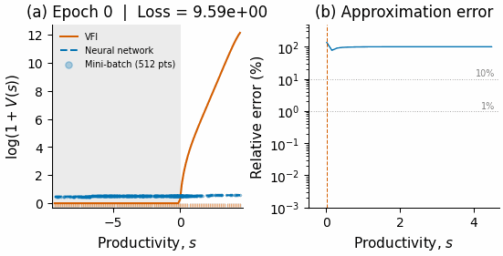
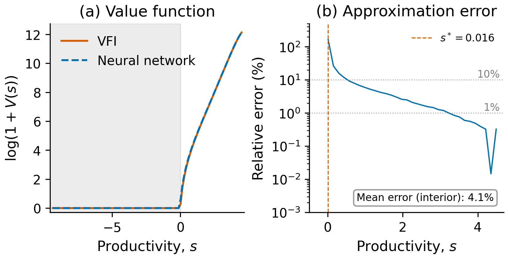

# Hopenhayn Firm Dynamics: VFI vs Deep Learning

> Inspired by the deep learning approach of [Mahdi Kahou](https://github.com/Mekahou) — check out his [McCall Search Model notebook](https://github.com/Mekahou/Notes/blob/main/deep_learning/McCall_DL.ipynb) for the pedagogical foundation this builds on.

Solving the stationary Hopenhayn (1992) firm dynamics model using both **Value Function Iteration** and a **neural network** that minimizes the Bellman residual. Based on the calibration in Hopenhayn, Neira & Singhania (2022).



---

## Methods

### Value Function Iteration (VFI)

Standard contraction mapping on a 100-point Tauchen grid. Iterate until convergence.

- **294 iterations**, **0.002 seconds**

### Deep Learning (neural network)

A feedforward network (4 hidden layers × 128 neurons, SiLU activation, Softplus output) minimizes the log-space Bellman residual using a Polyak-averaged target network for stability. The conditional expectation uses the **same Tauchen transition matrix** as VFI — an apples-to-apples comparison.

**Key design choices** (and why they matter):

| Feature | Why |
|---|---|
| **Log-space loss** | V(s) spans 5 orders of magnitude (0 to 186,000); raw MSE is dominated by high-V points |
| **Softplus output** | Guarantees V ≥ 0 without gradient-killing clamps |
| **Target network** (Polyak) | The RHS depends on V itself — without a frozen target, it's a moving-target problem that doesn't converge |
| **Adaptive mini-batch sampling** | Concentrates collocation points near the exit threshold where the kink is hardest to learn |
| **Early stopping** | Loss plateaus after ~36k epochs; no need for 200k |

- **~36,000 epochs**, **~90 seconds** (NVIDIA RTX 5080)

---

## Results

| | VFI | Neural Network |
|---|---|---|
| Exit threshold s* | 0.0160 | 0.0160 |
| Wall time | 0.002 s | 90 s |
| Mean relative error (interior) | — | 4.1% |



---

## Project structure

```
deepHopenhayn/
├── hopenhayn_VFI.ipynb              # VFI solution (run first)
├── hopenhayn_DL.ipynb               # Deep learning solution (loads VFI CSVs)
├── make_gif.py                      # Regenerate training animation
├── output_csv/
│   ├── v_VFI.csv, svec_VFI.csv      # VFI value function and grid
│   ├── nstar_VFI.csv, mustar_VFI.csv # Labor demand and firm distribution
│   └── v_nn_DL.csv, svec_nn_DL.csv  # NN value function and grid
└── output_figures/
    ├── value_function_VFI.png        # VFI plots
    ├── value_function_comparison_DL.png  # VFI vs NN
    ├── sampling_distribution_DL.png  # Mini-batch visualization
    └── hopenhayn_DL.gif             # Training animation
```

**Run order:** `hopenhayn_VFI.ipynb` → `hopenhayn_DL.ipynb`

---

## References

- Fernández-Villaverde, J. (forthcoming). Deep Learning for Solving Economic Models. *Journal of Economic Literature*. [Code & materials](https://www.sas.upenn.edu/~jesusfv/deeplearning.html)
- Fernández-Villaverde, J., Nuño, G., & Perla, J. (2024). Taming the Curse of Dimensionality: Quantitative Economics with Deep Learning. NBER Working Paper 33117. [Paper](https://www.nber.org/papers/w33117)
- Hopenhayn, H. (1992). Entry, Exit, and Firm Dynamics in Long Run Equilibrium. *Econometrica*, 60(5), 1127–1150.
- Hopenhayn, H., Neira, J., & Singhania, R. (2022). From Population Growth to Firm Demographics: Implications for Concentration, Entrepreneurship and the Labor Share. *Econometrica*, 90(4), 1879–1914.
